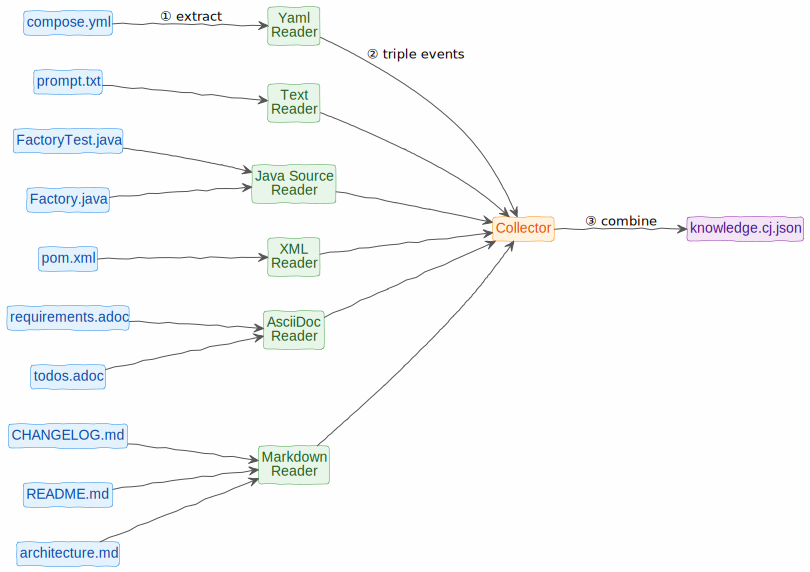
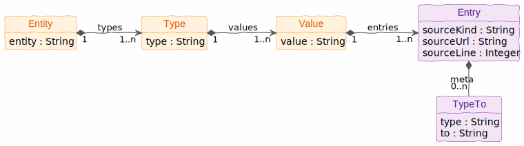

# ⚇ ddot.it &ndash; Developer Guide

Contents:
[Architecture](#architecture)
| [Syntax Specification](#syntax)
| [Reader](#reader)
| [Events](#events)
| [Collector](#collector)


## Architecture

1. A [reader](#reader) knows how to process a kind of source (e.g. Markdown or YAML)
2. and fires [triple events](#events) to a [collector](#collector).
3. The [collector](#collector) sends the resulting knowledge graph to a file or a pre-configured destination.

<p style="text-align: center">

</p>


## Syntax Specification
Non-terminals are UPPERCASED.
Terminal symbols (characters) are CamelCased.

### Codepoints
Ddot.it syntax assumes newline normalisation:

1. 'CR LF' -> NL;
2. Single 'LF' -> NL;
3. Single 'CR' -> NL.

| Name            |  Character  | Code Point | Usage              |
|-----------------|:-----------:|-----------:|--------------------|
| Tab             |    `\t`     |          9 | Sometimes stripped |
| Newline         | NL (LF, CR) |     10, 13 | Block separation   |
| Space           |     ` `     |         32 | Sometimes stripped |
| Comma           |     `,`     |         44 | Metadata           |
| Dot             |     `.`     |         46 | Triples            |

### Syntax

- Space and Tab character are stripped from name start or name end
- Example: `Dirk Hagemann   .. works at ..  Big Corp` becomes (`Dirk Hagemann`, `works at`, `Big Corp`)
```
SPACE        := (Space | Tab)+
NAME         := SPACE? ([^ \t]+) SPACE?
SUBJECT_NAME := NAME | `ddot.it/this`
```

- Text is chunked at three newlines into blocks
- Blocks are split into lines.
- At the end of a block, the current subject and meta-mode are reset.
- Triples cannot span blocks.

```
TEXT  := BLOCK (Newline Newline Newline BLOCK)*
BLOCK := LINE (Newline Newline? LINE)*
```

- A line is either a triple, an additional property, or a command.

```
LINE       := TRIPLE | ADDITIONAL | COMMAND
```

- A triple may state the link/property type (`..` type `..`).
- A triple can also omit the link type (`....`, `.. ..`), resulting in the default link type `links to`.

```
TRIPLE     :=   SUBJECT_NAME Newline? `..` NAME   `..` NAME META?
              | SUBJECT_NAME Newline? `..` SPACE? `..` NAME META?
```

- Additional properties on the same subject can be made by omitting the first part of the triple.

```
ADDITIONAL :=                `..` NAME   `..` NAME META?
              |              `..` SPACE? `..` NAME META?

```

- A [command](user-guide.md#commands) is any string starting with `ddot.it` and ending with whitespace.

```
COMMAND    := 'ddot.it[^ \n\t]*' (Space | Tab | Newline)
```

- Meta is usually a single line from double comma to the end of line (... `,,` META)
- Meta can also span multiple lines, if terminated by another double comma. (... `,,` Newline META-LINES `,,`).
- Meta can contain additional properties to annotate a triple

```
META       := META_LINE | META_BLOCK
META_TEXT  := NAME | ( '..' NAME '..' NAME )+
META_LINE  := SPACE? ',,' SPACE? META_TEXT SPACE?
META_BLOCK := SPACE? ',,' Newline META_TEXT (Newline META_TEXT)* Newline ',,'
```


### Syntax Example

```
Project Eagle..started in.. 2024
..doc site .. example.com/docbase/8dcjsid
John Doe..leads.. Project Eagle ,, ..since.. 2025
Project Eagle....Moonshot
```
This text is interpreted as this knowledge graph:

<p style="text-align: center;">
  
</p>


## Reader
A [ddot](README.md) reader reads a kind of document and fires triple events.

You type ddot.it syntax in the text syntax of a **host language**.
Each host language has its own way to process double-dot syntax.
It is common for ddot syntax to be used in comments, but in Markdown and AsciiDoc, source code blocks can also be used.

ddot readers exist or are planned for these document types:

- [Markdown](reader-markdown.md) (1)
- AsciiDoc (1)
- xml (for `pom.xml` files) (1)
- yaml (e.g. for docker compose files) (1)
- Java source files (either as comments or annotations)
- plain text files (1)
- HTML files (1)
- PowerPoint files

These require authentication:

- Google Contacts notes field
- Google Keep (1)
- Google Calendar entries (1)
- Todoist tasks (1)

(1) These can be realised as a browser extension. Aggregating triples locally for (a) download, (b) sending to an API endpoint (locally or graphinout.com account).


ddot readers must

- respect [ddot.it commands](user-guide.md#commands)
  - Process only included lines as defined by `ddot.it/on` and `ddot.it/off`.
- fire events for each recognized triple, as defined in the next section.


## Events
Triple events are JSON-formatted and have the following structure:

| Property   | Required | Description                                                                                                                   | Example                                |
|------------|----------|-------------------------------------------------------------------------------------------------------------------------------|----------------------------------------|
| `from`     | yes      | ⓢ Subject of triple (the object about which we say something)                                                                 | `ddot`                                 |
| `type`     | &mdash;  | Ⓟ Type (property) of triple. <br/>Defaults to `links to`.                                                                     | `url`                                  |
| `to`       | yes      | ⓞ Object of triple.                                                                                                           | `ddot.it`                              |
| `meta`     | &mdash;  | Additional properties on a triple.<br/>Formatted as an array of objects, each with `type` and `to`, just like normal triples. | `[{"type":"year",`<br/>`"to":"2026"}]` |
| `kind`     | yes      | Kind of source                                                                                                                | `markdown`                             |
| `source`   | yes      | Source of text.                                                                                                               | `/README.md`                           |
| `location` | yes      | Line number                                                                                                                   | `76`                                   |

### Command Handling
- `ddot.it/this`: At this level, `ddot.it/this` is just a `from` value.
Replacement happens in the [collector](#collector).
- `ddot.it/on` and `ddot.it/off`: These commands have been processed by the reader and are not emitted as events.

### Triple Event Example
```json
[
  { "from": "Project Eagle", "type": "started in", "to": "2024",
    "kind": "markdown", "source": "/README.md", "location": 1 },

  { "from": "Project Eagle", "type": "doc site", "to": "example.com/docbase/8dcjsid",
    "kind": "markdown", "source": "/README.md", "location": 2 },

  { "from": "John Doe", "type": "leads", "to": "Project Eagle",
    "meta": { "type": "since", "to": "2025" },
    "kind": "markdown", "source": "/README.md", "location": 3 },

  { "from": "Project Eagle", "type": "links to", "to": "Moonshot",
    "kind": "markdown", "source": "/README.md", "location": 4 }
]
```


## Collector
The collector combines all triple events and represents them as a single knowledge graph, expressed in [**Connected JSON** (CJ)](https://j-s-o-n.org) format.
At [GraphInOut.com](https://graphinout.com) CJ can be converted in a number of other graph formats.

<p style="text-align: center">

</p>

Triples logically form a tree: **entity** → **type** → **value** → Set of entries.
An entry contains source information (source kind, source url, source line) and optional triple metadata (string).
Duplicate triples thus result in multiple entries (each with a different source location) for the same triple.
