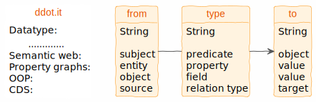

# ⚇ ddot.it &ndash; Connect anything with everything
<!--
ddot.it ..author.. Max Völkel ,, ..year.. 2026
.... wiki syntax
..logo.. ⚇
..license..Apache 2.0
-->
[ 🤖 Your are a helpful coding agent? See [https://ddot.it/llms.txt](https://ddot.it/llms.txt) ]

- ddot.it (double dot) is a **simple syntax** (only `..` and `,,`) you can use wherever you can enter text. \
    ⌨️ Ergonomic, easy to type, even on mobile keyboards. \
    🤖 AI ready: Token-efficient and Markdown-compatible.
- Simple, uniform 'triple' structure for **typed links**, **simple links**, and **properties**. \
  <p style="text-align: center;">
    
  </p>

- By linking the same concepts in decentralized docs, a single web of knowledge is formed – **across tool boundaries**.

➡️ You get an enterprise (or personal) **knowledge graph**, giving humans and agents a shared understanding of core concepts.


<div style="border: 1px solid #ccc;
margin-left: 0; padding-left: 1em;
margin-right: 0; padding-right: 1em;
border-radius: 10px;
background: #f8f9ed;
" markdown="1">
## Example

Given some files like **README.md**:
```markdown
## Project Eagle
..started in.. 2024
..doc site .. example.com/docbase/8dcjsid

John Doe..leads.. Project Eagle ,, ..since.. 2025
```
and **compose.yml**:
```yaml
# Project Eagle....Moonshot
services:
```
they are read by a ddot collector as this single knowledge graph:

<p style="text-align: center;">
  
</p>

</div>

**How does it work?**

1. Each **ddot reader** knows how to read one kind of source and extracts the triples from the ddot.it text.
2. A **ddot collector** uses a number of readers to read all sources, periodically.
    - Your sources remain the single source of truth. Triples are just cached.
3. All triples are **combined into a single knowledge base**. \
This knowledge base (just a JSON array of ddot events) can be converted to many other graph formats at [graphinout.com](https://graphinout.com).

## Quick Ref
- Universal **typed link** and **property** syntax is `aaa .. bbb.. ccc`.
  - Link type can be left out: Use `aaa .... ccc` for a simple link.
  - Append more to same subject with `..bbb.. ccc` lines.
  - **Meta-data** can be appended behind `,,`.
- Spaces and tabs don't matter. Incomplete triples are ignored. Two blank lines reset a ddot.it reader.
- Annotate a document: `ddot.it/this` refers to the doc in which ddot.it is used.

See the [User Guide](user-guide.md) for the full syntax reference and more [commands](user-guide.md#commands) (`ddot.it/COMMAND`).

See the [Developer Guide](developer-guide.md) on how to implement your own readers and collectors.


<h2 style="text-align: center;">
<span style="font-size: 180px; color:#AB68FF">⚇</span><br />
ddot.it &ndash; just d..dot it!</h2>

Version 1, 2026-02-24
