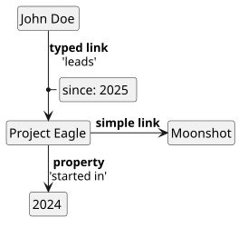
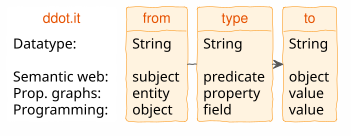

# ⚇ ddot.it &ndash; Connect anything with everything
<!--
ddot.it ..author.. Max Völkel ,, ..year.. 2026
.... wiki syntax
..logo.. ⚇
..license..Apache 2.0
-->

- ddot.it is a **simple syntax** using only double-dot (`..`) and double-comma (`,,`).
  - **Ergonomic**: ⌨️ Easy to type, even on mobile keyboards.  
  - **AI ready**:  🤖Token-efficient and Markdown-compatible.

- ddot.it can be used **wherever you can enter text**.
   - Add links, annotations and structured data directly into your existing **decentralized documents**: \
   [Markdown](reader-markdown.md) files, [Java](reader-java.md)Doc comments, Google Context notes field, [PowerPoint](reader-powerpoint.md) slide notes, Confluence pages, Maven pom.[xml](reader-xml.md) files, Word documents, email text, Docker compose [yaml](reader-yaml.md) files, [web pages](reader-html.md),  ...  
  - By using the same concepts, a single web of knowledge is formed – **across tool boundaries**.  

- You get an enterprise (or personal) **knowledge graph**, giving humans and agents a shared understanding of core concepts.


<div style="border: 1px solid #ccc;
margin-left: 0; padding-left: 1em;
margin-right: 0; padding-right: 1em;
border-radius: 10px;
background: #f8f9ed;
" markdown="1">
## Example

Given some files like **README.md**:
```markdown
## Project Eagle
..started in.. 2024
..doc site .. example.com/docbase/8dcjsid

John Doe..leads.. Project Eagle ,, ..since.. 2025
```
and **compose.yml**:
```yaml
# Project Eagle....Moonshot
services:
```
they are read by a ddot collector as this single knowledge graph:

<p style="text-align: center;">
  
</p>

</div>

**How does it work?**

A uniform 'triple' structure for **typed links**, **simple links**, and **properties**. 
  <p style="text-align: center;">
    
  </p>


1. Each **ddot reader** knows how to read one kind of source and extracts the triples from the ddot.it text.
2. A **ddot collector** uses a number of readers to read all sources, periodically.
    - Your sources remain the single source of truth. Triples are just cached.
3. All triples are **combined into a single knowledge base**. \
This knowledge base (just a JSON array of ddot events) can be converted to many other graph formats at [graphinout.com](https://graphinout.com).

## Quick Ref
- Universal **typed link** and **property** syntax is `aaa .. bbb.. ccc`.
  - Link type can be left out: Use `aaa .... ccc` for a simple link.
  - Append more to same subject with `..bbb.. ccc` lines.
  - **Meta-data** can be appended behind `,,`.
- Spaces and tabs don't matter. Incomplete triples are ignored. Two blank lines reset a ddot.it reader.
- Annotate a document: `ddot.it/this` refers to the doc in which ddot.it is used.

See the [User Guide](user-guide.md) for the full syntax reference and more [commands](user-guide.md#commands) (`ddot.it/COMMAND`).

See the [Developer Guide](developer-guide.md) on how to implement your own readers and collectors.

## Editor Support
- Free VSCode extension on [VSCode Marketplace](https://marketplace.visualstudio.com/items?itemName=calpano.ddot) and on [Open VSX Registry](https://open-vsx.org/extension/calpano/ddot)
- Free plugin for IntelliJ IDEA, IntelliJ IDEA Community, MPS, PhpStorm, JetBrains Gateway, GoLand, PyCharm, WebStorm, Code With Me Guest, Rider, PyCharm Community, CLion, DataSpell, RustRover, Android Studio, JetBrains Client, DataGrip, and RubyMine from [Jetbrains Marketplace](https://plugins.jetbrains.com/plugin/31651-ddot-it).
- ddot **textmate grammar** on
  [npmjs](https://www.npmjs.com/package/@calpano/ddot-textmate-grammar)
- ddot **shiki language registration** on
  [npmjs](https://www.npmjs.com/package/@calpano/ddot-shiki)
- highlight.js language definition on [npmjs](https://www.npmjs.com/package/@calpano/ddot-highlightjs)
- Prism.js language definition for ddot.it on [npmjs](https://www.npmjs.com/package/@calpano/ddot-prismjs)
- Rouge syntax highlighter on [rubygems](https://rubygems.org/gems/rouge-ddot) for Asciidoctor, Jekyll, GitLab
- Pygments lexer for ddot.it on [PyPI](https://pypi.org/project/pygments-ddot/)

<h2 style="text-align: center;">
<span style="font-size: 180px; color:#AB68FF">⚇</span><br />
ddot.it &ndash; just d..dot it!</h2>

**Coding agent? See [https://ddot.it/llms.txt](https://ddot.it/llms.txt)**
