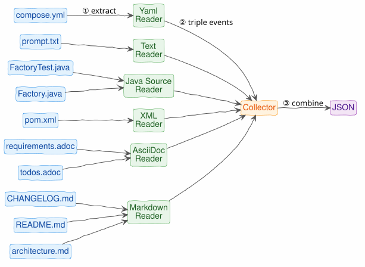
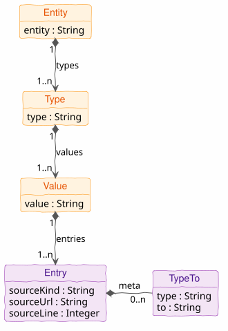

# ⚇ ddot.it &ndash; Developer Guide

Contents:
[Architecture](#architecture)
| [Syntax Specification](#syntax-specification)
| [Reader](#reader)
| [Events](#events)
| [Collector](#collector)


## Architecture

1. A [reader](#reader) knows how to process a kind of source (e.g. Markdown or YAML)
2. and fires [triple events](#events) to a [collector](#collector).
3. The [collector](#collector) sends the resulting knowledge graph to a file or a pre-configured destination.

<p style="text-align: center">

</p>


## Syntax Specification

See [Syntax Specification](syntax.md).


## Reader
A [ddot](README.md) reader reads a kind of document and fires triple events.

You type ddot.it syntax in the text syntax of a **host language**.
Each host language has its own way to process double-dot syntax.
It is common for ddot syntax to be used in comments, but in Markdown and AsciiDoc, source code blocks can also be used.

ddot readers exist or are planned for these document types:

- [Markdown](reader-markdown.md) (1)
- AsciiDoc (1)
- xml (for `pom.xml` files) (1)
- yaml (e.g. for docker compose files) (1)
- Java source files (either as comments or annotations)
- plain text files (1)
- HTML files (1)
- PowerPoint files

These require authentication:

- Google Contacts notes field
- Google Keep (1)
- Google Calendar entries (1)
- Todoist tasks (1)

(1) These can be realised as a browser extension or Android app.
Aggregating triples locally for (a) download, (b) sending to an API endpoint (locally or graphinout.com account).


ddot readers must

- respect [ddot.it commands](user-guide.md#commands)
  - Process only included lines as defined by `ddot.it/on` and `ddot.it/off`.
- fire events for each recognized triple, as defined in the next section.


## Events
A reader reports each recognised triple as one **triple event**: a JSON object, streamed as JSON
Lines ([JSONL](https://jsonlines.org/), one event per line).

The **normative** definition — field semantics, the meta-pair shape, key order and the escaping
rules a byte-exact implementation needs — is
[Triple Events in the Parse Specification](spec/ddot-it-parse.html#events). This section is a
summary; where the two disagree, the Parse Specification wins.

| Property   | Required | Description                                                                                                     | Example                                |
|------------|----------|-----------------------------------------------------------------------------------------------------------------|----------------------------------------|
| `from`     | yes      | ⓢ Subject of the triple (what we are saying something about). Already inherited if the line omitted it.         | `ddot`                                 |
| `type`     | &mdash;  | Ⓟ Relation of the triple. **Omitted** for untyped links (`....`); a consumer then defaults it to `links to`.    | `url`                                  |
| `to`       | yes      | ⓞ Object of the triple. Never empty.                                                                            | `ddot.it`                              |
| `meta`     | &mdash;  | Meta pairs, in source order — each with the same `type` (optional) and `to` keys as the triple. Omitted if none. | `[{"type":"year",`<br/>`"to":"2026"}]` |
| `kind`     | yes      | Kind of source                                                                                                  | `markdown`                             |
| `source`   | yes      | Source URI of the chunk                                                                                         | `/README.md`                           |
| `location` | yes      | 1-based line number                                                                                             | `76`                                   |

Three things catch people out, all spelled out in the specification:

- An untyped link **writes** `links to` into `type` rather than omitting the field.
- Free metadata text is not an untyped pair: `,, a random note` carries the built-in relation
  `text`, so it is `{"type": "text", "to": "a random note"}`. The untyped form is `,, .... 2025`,
  which yields `{"type": "links to", "to": "2025"}`.
- A line that is not a triple emits **nothing** — no event, no error.

### Command Handling
- `ddot.it/this`: At this level, `ddot.it/this` is just a `from` value.
Replacement happens in the [collector](#collector).
- `ddot.it/on`, `ddot.it/off` and `ddot.it/block`: processed by the reader before parsing, so they
are never emitted as events. A field filled by a `ddot.it/block` carries the block body as its
value, newlines included.

### Example

```json
{ "from": "Project Eagle", "type": "started in", "to": "2024",
  "kind": "markdown", "source": "/README.md", "location": 1 }
```
```json
{ "from": "Project Eagle", "type": "doc site", "to": "example.com/docbase/8dcjsid",
  "kind": "markdown", "source": "/README.md", "location": 2 }
```
```json
{ "from": "John Doe", "type": "leads", "to": "Project Eagle",
    "meta": [{ "type": "since", "to": "2025" }],
    "kind": "markdown", "source": "/README.md", "location": 3 }
```
```json
{ "from": "Project Eagle", "to": "Moonshot",
  "kind": "markdown", "source": "/README.md", "location": 4 }
```

(The last one is `Project Eagle .... Moonshot` — note the absent `type`. The examples are spaced
for readability; real JSONL output has one event per line with no insignificant whitespace.)


## Collector
The collector combines all triple events and represents them as a single knowledge base, simply a JSON file with all events concatenated.
At [graphinout.com](https://graphinout.com) this format can be converted (SOON) to a number of other graph formats, including [**Connected JSON** (CJ)](https://j-s-o-n.org) format.

<p style="text-align: center">

</p>

Triples logically form a tree: **entity** → **type** → **value** → Set of entries.
An entry contains source information (source kind, source url, source line) and optional triple metadata (string).
Duplicate triples thus result in multiple entries (each with a different source location) for the same triple.
