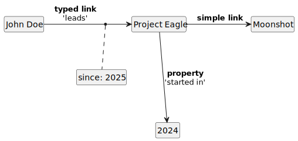

# ⚇ ddot.it &ndash; Syntax Specification

Non-terminals are UPPERCASED.
Terminal symbols (characters) are CamelCased.

## Codepoints
Ddot.it syntax assumes newline normalisation:

1. 'CR LF' -> NL;
2. Single 'LF' -> NL;
3. Single 'CR' -> NL.

| Name            |  Character  | Code Point | Usage              |
|-----------------|:-----------:|-----------:|--------------------|
| Tab             |    `\t`     |          9 | Sometimes stripped |
| Newline         | NL (LF, CR) |     10, 13 | Block separation   |
| Space           |     ` `     |         32 | Sometimes stripped |
| Comma           |     `,`     |         44 | Metadata           |
| Dot             |     `.`     |         46 | Triples            |

## Syntax

- Space and Tab character are stripped from name start or name end
- Example: `Dirk Hagemann   .. works at ..  Big Corp` becomes (`Dirk Hagemann`, `works at`, `Big Corp`)
```
SPACE        := (Space | Tab)+
NAME         := SPACE? ([^ \t]+) SPACE?
SUBJECT_NAME := NAME | `ddot.it/this`
```

- Text is chunked at three newlines into blocks
- Blocks are split into lines.
- At the end of a block, the current subject and meta-mode are reset.
- Triples cannot span blocks.

```
TEXT  := BLOCK (Newline Newline Newline BLOCK)*
BLOCK := LINE (Newline Newline? LINE)*
```

- A line is either a triple, an additional property, or a command.

```
LINE       := TRIPLE | ADDITIONAL | COMMAND
```

- A triple may state the link/property type (`..` type `..`).
- A triple can also omit the link type (`....`, `.. ..`), resulting in the default link type `links to`.

```
TRIPLE     :=   SUBJECT_NAME Newline? `..` NAME   `..` NAME META?
              | SUBJECT_NAME Newline? `..` SPACE? `..` NAME META?
```

- Additional properties on the same subject can be made by omitting the first part of the triple.

```
ADDITIONAL :=                `..` NAME   `..` NAME META?
              |              `..` SPACE? `..` NAME META?

```

- A [command](user-guide.md#commands) is any string starting with `ddot.it` and ending with whitespace.

```
COMMAND    := 'ddot.it[^ \n\t]*' (Space | Tab | Newline)
```

- Meta is usually a single line from double comma to the end of line (... `,,` META)
- Meta can also span multiple lines, if terminated by another double comma. (... `,,` Newline META-LINES `,,`).
- Meta can contain additional properties to annotate a triple

```
META       := META_LINE | META_BLOCK
META_TEXT  := NAME | ( '..' NAME '..' NAME )+
META_LINE  := SPACE? ',,' SPACE? META_TEXT SPACE?
META_BLOCK := SPACE? ',,' Newline META_TEXT (Newline META_TEXT)* Newline ',,'
```


## Syntax Example

```
Project Eagle..started in.. 2024
..doc site .. example.com/docbase/8dcjsid
John Doe..leads.. Project Eagle ,, ..since.. 2025
Project Eagle....Moonshot
```
This text is interpreted as this knowledge graph:

<p style="text-align: center;">
  
</p>